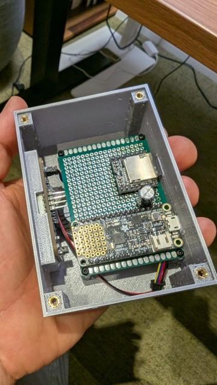

# Arduino based Alarm Clock

This is a fun project I built for my daugther, where she led the design. The alarm clock features snooze functionality and - most importantely - a couple of selectable alarm sound tracks like a rooster, barking dog, etc. 😊

For the logic I've used a finite state machine to control the events. The design uses entirely static methods and variables to reduce RAM usage. The snooze button got debounced with the famouse Bounce2 library.

A long press on the snooze button allows adjusting the time. To green latching button enables and disables the alaram. A press on the rotary button enters alarm setup mode, where the alarm time and alarm track can be selected.

## Hardware

### Electrical components

* Adafruit Feather 328p (https://www.adafruit.com/product/3458)
* DFPlayer Mini (DFR0299)
* Adafruit DS3231 RTC (https://www.adafruit.com/product/5188)
* Speaker 8 Ohm 2W
* Capacitor 470uF (for noise filtering)
* 7 Segment display HT16K33 bagback (https://www.adafruit.com/product/813)
* Adafruit Rotary Encoder (https://www.adafruit.com/product/4991) as a multiselect controller for setup
* Latching button with LED to enable/disable alaram (green)
* Momentary push button with LED for snooze (yellow)

### Case

The model was designed with FreeCAD and printed with a Prusa Mini+ using PLA. The source file can be found in the `model` folder.

### Screwed connection

#### Printed threads

I had to carry out a couple of experiments to find a proper way for the threaded connections. First I started out with printed threads.

This serves well as a quick solution when 3d-printed with a higher resolution (smaller layer height) and used with the following parameters in FreeCAD.

- Select thread class `6H` (internal thread) or `6G` (external thread) when printing.
- When `Counterbore` then, use `Depth` of `2mm` for `M3` screws
- Add `0.10mm` to the depth to accommodate for build tolerances of the screw in its length
- Leave at least `2 mm`

#### Melt-in thread inserts

Printed threads would have been sufficient for this type of project since there isn't much pulling force to be expected on the screws.

Still I decided against it in favour of melt-in thread inserts which simplify the 3D modelling process and assembling. Also it gives the case a more professional look!

